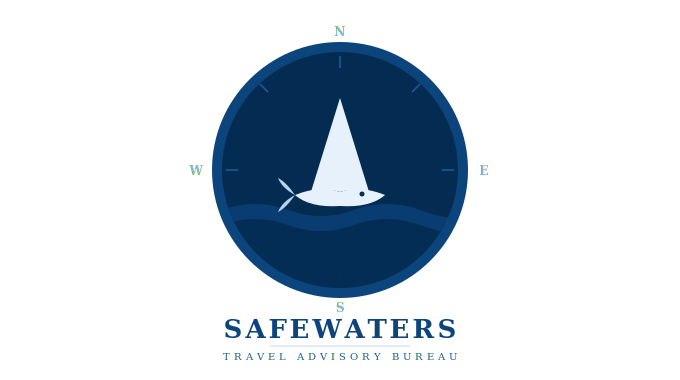

<table>
<tr>
<td></td>
<td><h1>Shark Attack Analysis</h1></td>
</tr>
</table>

An exploratory data analysis of global shark attack incidents using the **Global Shark Attack File (GSAF)** dataset.

---

## Team

This project was developed collaboratively as part of the IronHack Data Analytics Bootcamp, simulating a data analysis brief for the SafeWaters Travel Advisory Bureau — a tourism organisation focused on travel safety recommendations.

- Anwen Roberts
- Gabriela Cascione
- Salem Ibrahim

---

## Dataset

| Detail | Info |
|---|---|
| **Source** | [Global Shark Attack File – Incident Log](https://www.sharkattackfile.net/incidentlog.htm) |
| **File** | `GSAF5.xls` |
| **Records** | 7,082 incidents |
| **Columns** | 23 |
| **Time span** | Historical records through March 2026 |

### Columns Overview

| Column | Description |
|---|---|
| `Date` | Date of the incident |
| `Year` | Year of the incident |
| `Type` | Provoked, Unprovoked, Watercraft, Sea Disaster, Invalid, etc. |
| `Country` | Country where the incident occurred |
| `State` | State or region |
| `Location` | Specific location description |
| `Activity` | What the victim was doing (surfing, swimming, fishing, etc.) |
| `Name` | Name of the victim |
| `Sex` | Sex of the victim |
| `Age` | Age of the victim |
| `Injury` | Description of injuries sustained |
| `Fatal Y/N` | Whether the incident was fatal |
| `Time` | Time of day of the incident |
| `Species` | Shark species involved |
| `Source` | Source of the report |

---

## Hypotheses

### When
1. Shark attacks are more likely to occur during summer months than winter months at each destination.
2. Shark attacks are more likely to occur during afternoon hours than any other time of day.

### What
1. Swimming is the activity with the highest number of shark attacks due to being a common activity in the water.

### Where
1. The USA, Australia and South Africa account for the highest number of shark attacks globally.
2. The number of shark attacks has increased globally over the last decades.

---

## Data Cleaning

### Dropped & Renamed Columns
- **Dropped**: `Name`, `Source`, `pdf`, `href`, `href formula`, `Case Number`, `Case Number.1`, `original order` — PII or not relevant for analysis; `Unnamed: 21`, `Unnamed: 22` — legacy empty columns from the original Excel file
- **Renamed**: all column names lowercased and renamed for consistency (`fatal y/n` → `fatal_yes_no`, `type` → `attack_type`, `sex` → `gender`)

### Standardised Columns
- **`attack_type`**: stripped, lowercased and standardised to `Unprovoked`, `Provoked`, `Watercraft` or `NaN`
- **`fatal_yes_no`**: inconsistent values mapped to `Yes`, `No` or `NaN`
- **`gender`**: invalid entries (`?`, `lli`, `m x 2`, etc.) replaced with `NaN`; valid values uppercased
- **`year`**: rows with year before 1900 and null values removed; column converted to integer
- **`country`**: lowercased, stripped and spelling inconsistencies standardised; rows where country, state and location were all null dropped (no way to identify location)

### New Derived Columns
- **`hemisphere`**: derived from `country`, labelling each incident as `Northern` or `Southern`
- **`month`**: extracted from the messy `date` column using regex and datetime parsing
- **`time_of_day`**: derived from `time`, categorising incidents into `Morning`, `Afternoon`, `Evening` or `Night`
- **`season`**: derived from `month` and `hemisphere`, accounting for seasonal differences between hemispheres

### Activity Column
The `activity` column contained 600+ unique values including detailed narrative descriptions of historical incidents. Since the analysis focuses on the top activities only, no further standardisation was performed. The column was converted to string type and stripped to ensure compatibility for analysis.

---

## Methodology

The analysis was scoped to **1976–2026** (last 50 years) for more reliable and relevant data.

### When
- Season distribution analysed using `value_counts()` and a bar chart
- Crosstab tables built to compare season counts and percentages by hemisphere, accounting for seasonal differences between Northern and Southern hemispheres
- Time of day distribution analysed using `value_counts()` and a bar chart

### What
- Top 5 activities identified by count; all others grouped into `Other`
- Bar chart built from aggregated counts
- Top 10 activities listed for broader reference
- Most fatal activities in the top 3 countries identified separately

### Where
- Top 10 countries identified by count; all others grouped into `Other`
- Bar chart built from aggregated counts
- Top 3 countries isolated for time series analysis (attacks per year, 1976–2026)
- Global time series built to observe overall trend over the last 50 years

## Tools Used

- **Python** (Pandas, Matplotlib, Seaborn)
- **Jupyter Notebook**

---

## Repository Structure

```
shark-attack-analysis/
│
├── data/
│   ├── raw_data_GSAF5.xls              # Raw dataset (not modified)
│   └── shark_data_clean.pkl            # Cleaned and wrangled dataset
│
├── Plots/                              # Exported visualisations
│   ├── activity_bar.png
│   ├── country_bar.png
│   ├── fatal_activities_bar.png
│   ├── season_bar.png
│   ├── time_series_attack.png
│   ├── tod_bar.png
│   └── top_3_timeseries.png
│
├── shark_data_cleaning.ipynb           # Data wrangling and cleaning
├── shark_data_analysis.ipynb           # Exploratory data analysis
├── safewaters_presentation.pdf         # Final presentation
├── shark_travel_advisory_logo.svg      # Project logo
│
└── README.md
```

---

## How to Run

1. Clone the repository and open the notebook:
   ```bash
   git clone https://github.com/craftedbygaby/shark-attack-analysis.git
   cd shark-attack-analysis
   jupyter notebook notebooks/shark_attack_analysis.ipynb
   ```

2. Install dependencies if needed:
   ```bash
   pip install pandas numpy matplotlib seaborn xlrd
   ```

---

## Notes

- This dataset is maintained by the [Global Shark Attack File](https://www.sharkattackfile.net/), a not-for-profit organisation.
- The data spans centuries of records, so older entries may be less complete or reliable than recent ones.
- All analysis is for educational and portfolio purposes only.
